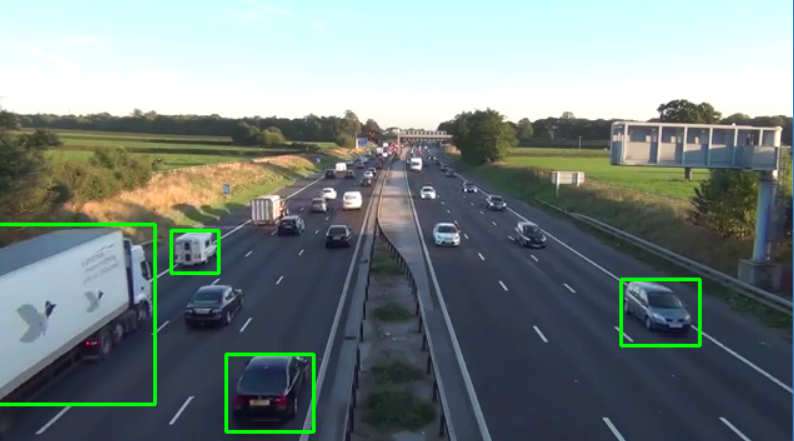

# Traffic Detect
> Quantifying traffic levels given an input video stream of a highway



# Dependencies
* CMake
* youtube-dl (https://youtube-dl.org/)
* OpenCV (https://opencv.org/)

# To Build
```
$ git clone https://github.com/tazzaoui/traffic-detect.git
$ cd traffic-detect
$ mkdir build 
$ cd build
$ cmake ..
```

# Downlaoding Input Data
To download sample input data, use the script `data/getvids.sh`. 
This will download videos corresponding to the youtube links specified in `data/videolinks.txt`.

`$ cd data && ./getvids.sh`
